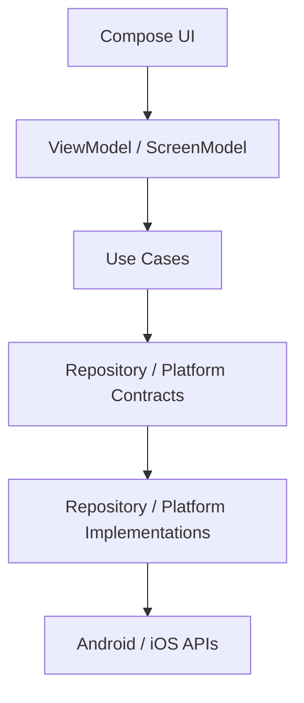

# SharedSocial-KMP


**SharedSocial-KMP** è uno **showcase tecnico** che dimostra come progettare una mobile app moderna utilizzando **Kotlin Multiplatform** e **Compose Multiplatform**, mantenendo business logic condivisa, integrazioni native Android/iOS e un'architettura orientata alla scalabilità.

Il progetto simula una **piattaforma social** e mette in evidenza competenze in:

- architetture mobile scalabili
- sviluppo cross-platform
- integrazione con API native
- gestione media (foto / video)
- sicurezza dei dati
- osservabilità e CI/CD

> Questo repository è pensato come **portfolio tecnico**: alcune feature sono complete end-to-end, altre sono volutamente lasciate a uno stadio intermedio per mostrare i confini architetturali e i prossimi step evolutivi.

---

## 🎬 Demo


Il video mostra:

- bootstrap applicativo e routing iniziale
- registrazione / login
- home pager con flusso **Photo → Feed → Video**
- preview camera nativa
- acquisizione foto
- registrazione video
- selezione media da libreria
- schermata **Create Post** con preview del media e caption

---

## 🎯 Project Purpose

L'obiettivo del progetto è mostrare come costruire un'app mobile cross-platform che:

- condivida **business logic** tra Android e iOS
- mantenga **UI condivisa** con Compose Multiplatform
- utilizzi **servizi nativi quando necessario**
- rimanga **architetturalmente pulita e testabile**
- integri componenti reali di backend, persistenza e observability

La repo non è una semplice demo di UI: è pensata per evidenziare il modo in cui si progettano **confini architetturali, adapter di piattaforma e flussi applicativi reattivi** in un contesto KMP.

---

## ✨ Current Feature Set

### Authentication
- login utente
- validazione input
- gestione sessione
- persistenza sicura dei token

### Registration
- registrazione utente
- validazione form
- mapping errori dedicato
- integrazione con backend REST

### Feed
- caricamento post
- refresh
- like/unlike ottimistico
- input per nuovo contenuto testuale
- architettura pronta per arricchimento con media rendering

### Home Pager
- orchestrazione principale dell'app post-login
- esperienza di navigazione orizzontale ispirata alle app social
- composizione di tre stati logici:
    - **Photo**
    - **Feed**
    - **Video**

### Camera & Media
- preview camera nativa Android/iOS
- acquisizione foto
- registrazione video
- selezione media da libreria
- gestione permessi camera/microfono
- astrazioni condivise per preview, picker e servizi camera

### Create Post
- preview del media selezionato/acquisito
- inserimento caption
- costruzione della bozza di pubblicazione
- separazione architetturale tra acquisizione media e composizione del post

### Observability
- Analytics
- Crash reporting
- integrazione con ecosistema Firebase

---

## 🛠 Tech Stack

### Core
- **Kotlin**
- **Kotlin Multiplatform**
- **Compose Multiplatform**
- **Coroutines / Flow**
- **Voyager**
- **Koin**

### Networking
- **Ktor Client**
- **Kotlin Serialization**
- integrazione REST con backend Spring Boot

### Native integrations
- **Android**
    - CameraX
    - PreviewView
    - Activity Result API
    - DataStore
    - Google Tink
- **iOS**
    - AVFoundation
    - AVCaptureSession / AVCaptureVideoPreviewLayer
    - PHPicker
    - Keychain
    - Swift bootstrap per i servizi nativi

### Observability & Platform Services
- **Firebase Analytics**
- **Firebase Crashlytics**
- **Push / notification capability setup**
- log e servizi nativi integrati in modo multipiattaforma

### Testing
- **Mokkery**
- **Turbine**
- **Robolectric**
- dispatcher di test dedicati

---

## 🏗 Architecture at a Glance

Il progetto utilizza una **feature-based architecture** combinata con i principi della **Clean Architecture**.

Ogni feature evolve attorno a tre layer principali:

```text
feature
 ├── presentation
 ├── domain
 └── data
```

Le integrazioni native non vengono chiamate direttamente dal dominio, ma attraversano contratti condivisi e implementazioni di piattaforma.



Per una spiegazione completa della struttura e dei trade-off:

- [`docs/architecture.md`](docs/architecture.md)
- [`docs/design_decisions.md`](docs/design_decisions.md)

---

## 🍎 Native Services & Secure Storage

Le capability specifiche di piattaforma sono incapsulate dietro contratti condivisi.

Esempi significativi nella repo:

- `AnalyticsService`
- `CameraService`
- `CameraPermissionService`
- `CameraPermissionRequester`
- `CameraPreviewRenderer`
- `MediaPickerService`
- `MediaPreviewRenderer`
- `SecureStorage`

### Android
- CameraX per preview, photo capture e video recording
- DataStore + Google Tink per persistenza sicura
- componenti Android-specifici per permission request e media preview

### iOS
- AVFoundation per preview, capture e recording
- PHPicker per media selection
- Keychain per secure storage
- servizi Swift iniettati nel mondo KMP tramite Koin bootstrap

---

## 🌐 Backend & API Ecosystem

L'applicazione dialoga con un backend **REST** sviluppato in **Spring Boot**, pensato per supportare un dominio social con autenticazione stateless.

Caratteristiche del flusso client/server:

- autenticazione **JWT**
- comunicazione **HTTPS**
- documentazione API tramite **OpenAPI / Swagger**
- mapping esplicito DTO → Domain

Swagger UI:

👉 https://socialmaster.ddns.net/swagger-ui/index.html

---

## 🚀 CI/CD

Il progetto include una pipeline **GitHub Actions** con:

- esecuzione dei test
- build Android
- build framework/shared layer per iOS
- build dell'app iOS via Xcode CLI
- upload degli artefatti

Questo rende la repo più vicina a un flusso di lavoro reale e non solo a una demo locale.

---

## 🧪 Testing Strategy

La strategia di test punta a verificare soprattutto:

- use case
- ViewModel
- persistenza
- navigation flow
- comportamento asincrono tramite dispatcher controllati

Il repository include:

- test nel modulo `commonTest`
- test di ViewModel
- test di persistenza/auth
- test UI Android con Robolectric

---

## 📁 Project Structure

```text
composeApp/
 ├── src/commonMain/
 │   ├── core/
 │   ├── features/
 │   └── root/
 │
 ├── src/androidMain/
 └── src/iosMain/

iosApp/
docs/
```

Feature principali presenti oggi:

```text
auth
register
feed
camera
createpost
home
root
```

---

## 🗺 Roadmap

### Completed
- Kotlin Multiplatform setup
- Compose Multiplatform UI
- authentication flow
- secure storage multipiattaforma
- feed architecture
- home pager
- camera feature Android/iOS
- media picker Android/iOS
- create post draft flow
- CI pipeline base

### In Progress
- integrazione submit reale della feature create post
- rendering media nel feed
- consolidamento documentazione e polishing UX

### Planned
- upload media
- image loading multipiattaforma
- video playback nel feed
- offline/cache strategy
- evoluzione della feature createpost verso pubblicazione completa

---

## 📚 Technical Documentation

Per il dettaglio tecnico:

- [`docs/architecture.md`](docs/architecture.md)
- [`docs/design_decisions.md`](docs/design_decisions.md)

---

## Author

**Massimiliano Pugliatti**  
Mobile Developer