# Architecture Overview

SharedSocial-KMP è strutturato secondo una **feature-based architecture** combinata con principi di **Clean Architecture** e con un uso esplicito di **astrazioni di piattaforma** per tutte le capability native rilevanti.

L'obiettivo dell'architettura è:

- mantenere la **business logic condivisa** tra Android e iOS
- isolare le **integrazioni native** dietro contratti comuni
- garantire **testabilità** dei flussi applicativi
- permettere una crescita modulare per feature
- mantenere separati **stato UI**, **orchestrazione**, **dominio** e **infrastruttura**

---

## 1. High Level Architecture

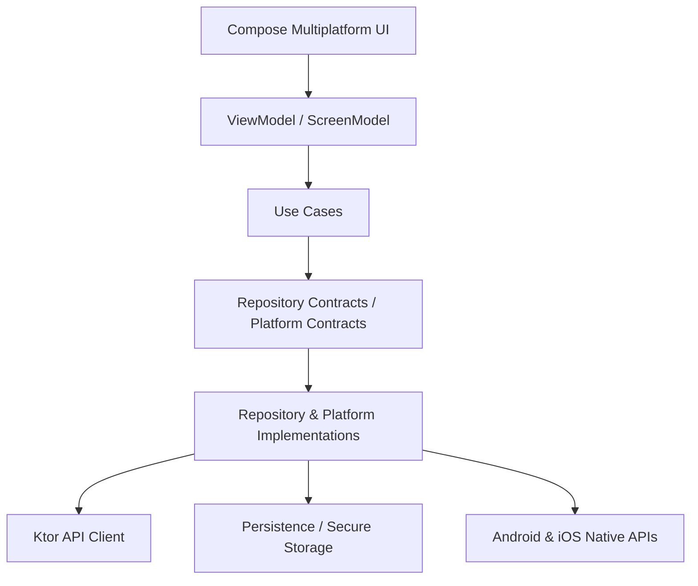

La logica applicativa rimane nel codice condiviso, mentre le integrazioni native vengono delegate alle implementazioni specifiche per piattaforma.

---

## 2. Top-Level Modules

```text
composeApp/
 ├── src/commonMain/
 │   ├── core/
 │   ├── features/
 │   └── root/
 │
 ├── src/androidMain/
 ├── src/iosMain/
 ├── src/commonTest/
 └── src/androidUnitTest/

iosApp/
docs/
```

### Ruolo dei moduli principali

- `commonMain`: logica condivisa, UI condivisa, use case, repository contracts, navigator, stato
- `androidMain`: adapter Android, facade native, secure storage, media preview, permission request
- `iosMain`: adapter iOS/Kotlin, renderer media, wiring Koin lato Apple
- `iosApp`: bootstrap Swift, servizi nativi Swift, integrazione AVFoundation/Keychain/Firebase

---

## 3. Feature-based Structure

Il progetto utilizza una **feature-based structure**.

Ogni feature contiene i propri layer:

```text
feature
 ├── presentation
 ├── domain
 └── data
```

Feature attualmente presenti:

```text
features
 ├── auth
 ├── register
 ├── feed
 ├── camera
 ├── createpost
 └── home
```

A queste si aggiunge il modulo `root`, che gestisce il bootstrap iniziale dell'app e il routing post-avvio.

---

## 4. Layer Responsibilities

### Presentation

Il layer presentation contiene:

- schermate Compose
- `ScreenModel` / ViewModel
- gestione stato con `StateFlow`
- gestione eventi
- trasformazione degli errori di dominio in feedback UI
- orchestrazione della navigazione

Flusso tipico:

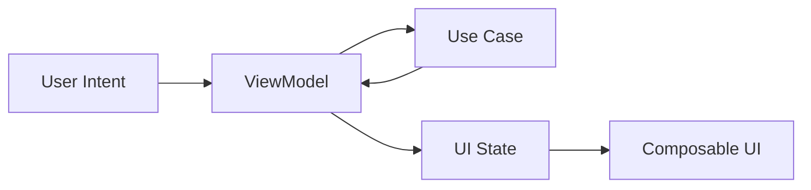

### Domain

Il layer domain contiene:

- use case
- modelli di business
- contratti repository
- errori di dominio
- validation logic

Il dominio non dipende da framework UI, networking o API native.

### Data

Il layer data contiene:

- repository implementations
- DTO
- mapper
- gestione errori tecnici
- adapter infrastrutturali

Per la camera, il layer data include anche la conversione delle failure tecniche in `CameraError`.

### Platform

Il layer platform rappresenta l'insieme delle capability native esposte al codice condiviso tramite contratti.

---

## 5. Root & App Bootstrap

L'app parte da `RootScreen`, che delega a `RootViewModel` la decisione iniziale:

- utente autenticato → home
- utente non autenticato → login

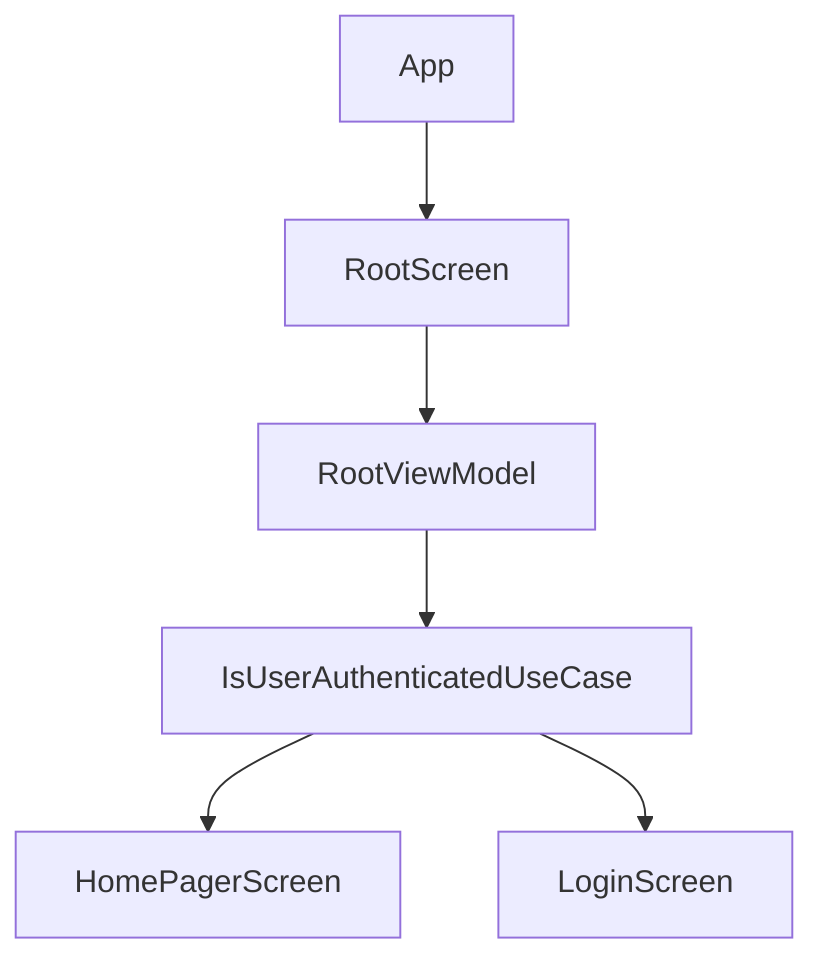

Questa scelta mantiene il routing iniziale fuori dalle schermate funzionali.

---

## 6. Reactive Navigation

La navigazione è implementata tramite un approccio **reattivo**.

I ViewModel non conoscono direttamente l'API concreta di Voyager: emettono eventi attraverso `AppNavigator`.

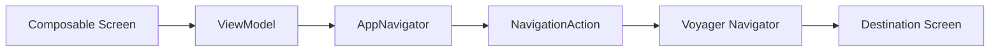

### Benefici

- disaccoppiamento tra UI framework e business logic
- navigazione testabile
- facilità nel coordinare flussi come:
    - root → login/home
    - camera → create post
    - auth → register/home

---

## 7. Cross-cutting Services

Nel modulo `core` vivono componenti condivisi riusabili:

### `core/navigation`
- `AppNavigator`
- `AppNavigatorImpl`
- `NavigationAction`

### `core/network`
- configurazione client Ktor
- setup serializzazione/network stack

### `core/dispatchers`
- `AppDispatchers`
- `RealAppDispatchers`
- dispatcher di test nel modulo test

### `core/platform`
contratti per servizi nativi, ad esempio:

```text
AnalyticsService
CameraService
CameraPermissionService
CameraPermissionRequester
CameraPreviewRenderer
MediaPickerService
MediaPreviewRenderer
```

### `core/service`
servizi condivisi non strettamente legati a una feature, ad esempio:
- `NotificationPermissionService`

---

## 8. Auth / Register / Feed

### Auth
La feature `auth` gestisce:

- login
- validazione input
- persistenza sessione
- integrazione con analytics e notifiche tramite decorator

### Register
La feature `register` segue lo stesso pattern di `auth`:

- validazione form
- repository dedicato
- mapper errori data/presentation

### Feed
La feature `feed` contiene:

- caricamento post
- refresh
- like/unlike ottimistico
- composizione locale di nuovo contenuto testuale
- repository dedicato e decorator

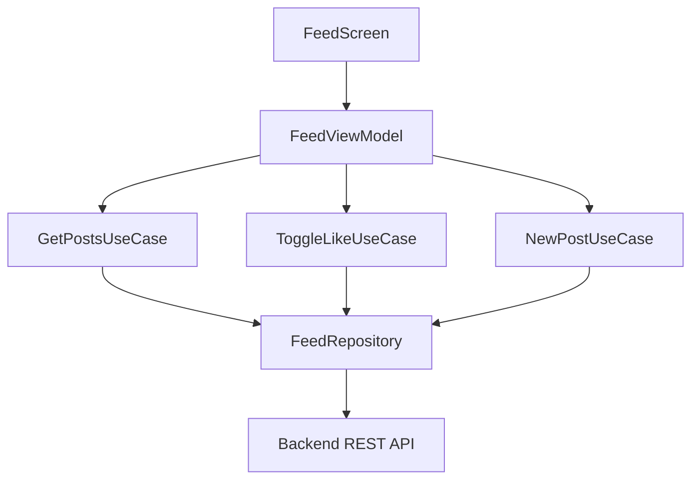

---

## 9. Repository Decorator Pattern

Uno degli aspetti più interessanti della repo è l'uso del **Decorator Pattern** sui repository.

L'obiettivo è aggiungere logica cross-cutting senza contaminare l'implementazione core.

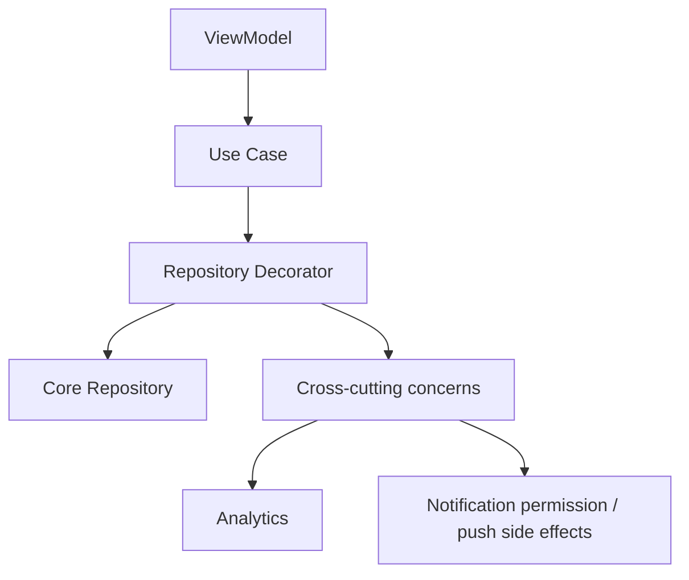

Repository decorati presenti nella repo:

```text
AuthRepositoryDecorator
RegisterRepositoryDecorator
FeedRepositoryDecorator
```

---

## 10. Error Handling Strategy

Le eccezioni tecniche non vengono propagate direttamente alla UI.

Il progetto usa una strategia a più livelli:

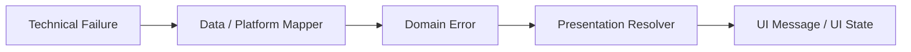

Questo consente alla presentation di reagire a **errori semantici** invece che a dettagli tecnici.

Mapper e resolver presenti nella repo:

```text
AuthErrorMapper
RegisterErrorMapper
FeedErrorMapper
CameraErrorMapper

AuthErrorUIResolver
RegisterErrorUIResolver
FeedErrorUIResolver
CameraErrorUiResolver
```

### Camera error flow

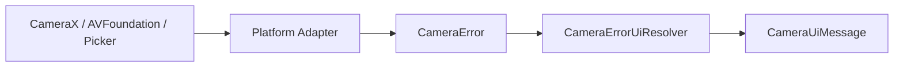

---

## 11. Secure Storage & Observability

### Secure Storage

Il progetto usa una strategia nativa per ogni piattaforma.

#### Android
- DataStore
- Google Tink

#### iOS
- Keychain

Il codice condiviso dipende dal contratto:

```text
SecureStorage
```

### Observability

Il progetto integra servizi analytics/crash reporting tramite adapter nativi incapsulati dietro:

```text
AnalyticsService
```

Questo mantiene l'osservabilità accessibile dal codice condiviso senza introdurre dipendenze dirette verso SDK specifici.

---

## 12. Camera & Media System

La feature camera è una delle parti più architetturalmente rilevanti della repo.

La logica condivisa utilizza queste interfacce:

```text
CameraService
CameraPermissionService
CameraPermissionRequester
CameraPreviewRenderer
MediaPickerService
MediaPreviewRenderer
```

### Android implementation
- CameraX
- PreviewView
- Activity Result API
- permission request runtime

Classi principali:

```text
AndroidCameraFacade
AndroidCameraPermissionRequester
AndroidMediaPickerService
AndroidMediaPreviewRenderer
AndroidCameraErrorMapper
```

### iOS implementation
- AVFoundation
- AVCaptureSession / AVCaptureVideoPreviewLayer
- PHPicker
- servizi Swift integrati nel bootstrap KMP

Classi principali:

```text
IOSCameraFacade
IOSCameraEngine
IOSCameraEngineError
IOSMediaPickerService
IOSCameraPermissionRequester
IOSMediaPreviewRenderer
```

---

## 13. Home Pager Architecture

La home principale è basata su un **HorizontalPager** con tre destinazioni logiche:

```text
Photo | Feed | Video
```

La soluzione adottata evita di creare due sessioni camera separate.

### Principio architetturale

- un solo `CameraViewModel`
- una sola preview nativa attiva per piattaforma
- due pagine camera che mostrano i controlli
- una feature `home` che orchestra pager, visibilità e lifecycle camera

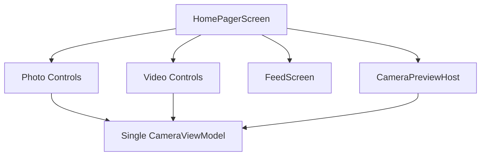

### Perché questa scelta

Questa soluzione è stata adottata per garantire stabilità cross-platform, in particolare nel contesto:

- `PreviewView` su Android
- `UIViewController` / `AVCaptureVideoPreviewLayer` su iOS

---

## 14. Media Flow

Il flusso media oggi è:

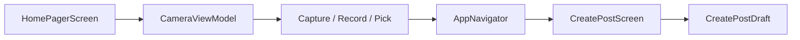

I media sono rappresentati nel dominio tramite:

```text
MediaAsset
 ├── Photo
 └── Video
```

Questo consente alla business logic di lavorare in modo uniforme su entrambe le piattaforme.

---

## 15. Create Post as Separate Feature

La composizione del post non vive dentro la feature camera.

La feature `createpost` è separata perché mantiene distinti:

- acquisizione/selezione media
- composizione del contenuto
- futura pubblicazione/upload

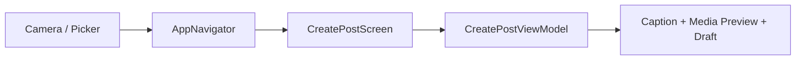

Attualmente la feature costruisce una bozza di post e mostra il confine architetturale verso il futuro repository di pubblicazione.

---

## 16. Dependency Injection

La dependency injection è gestita tramite **Koin**.

Il progetto usa:

- moduli condivisi
- moduli platform-specific
- bootstrap iOS via Swift
- binding multipiattaforma per servizi nativi

Esempi presenti:

```text
commonModule
androidModule
cameraAndroidModule
initKoin(...) lato iOS
cameraIosModule(...)
```

Questa strategia mantiene il wiring coerente tra common e platform layer.

---

## 17. Testing Strategy

Il repository include:

- unit test in `commonTest`
- test su use case auth
- test su persistenza/sessione
- test su root routing
- test UI Android con Robolectric

Lo stack di test è coerente con l'obiettivo del progetto: validare la **business logic condivisa** senza dipendere da emulatori o device reali per ogni scenario.

---

## 18. Architectural Goals

L'architettura del progetto è progettata per garantire:

- separazione delle responsabilità
- isolamento delle dipendenze di piattaforma
- testabilità della business logic
- riusabilità dei componenti
- scalabilità del codice
- simmetria concettuale tra Android e iOS
